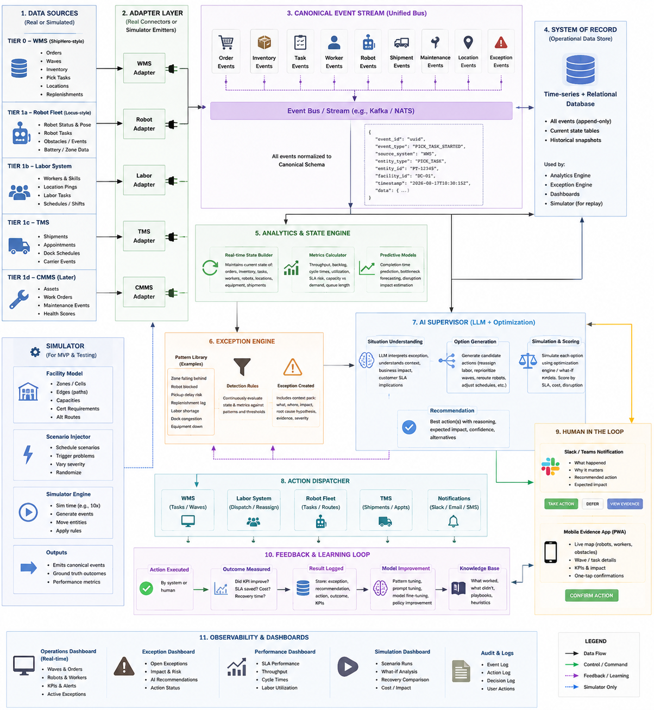

# Mid-Market 3PL AI Operations Supervisor --- MVP Architecture

## 1. Product Goal

Build a **SaaS AI operations supervisor for mid-market 3PL warehouses**.

The system connects to operational systems the warehouse already uses,
builds a live picture of warehouse operations, detects when the
operation is deviating from plan, predicts the business impact, proposes
recovery actions, and measures whether those actions worked.

The core loop is:

**Observe → Detect → Diagnose → Evaluate Actions → Recommend/Act →
Measure Recovery → Learn**

The first MVP does **not** need to replace the WMS, WCS, PLCs, robot
fleet manager, or CMMS. It sits above these systems as an orchestration
and decision layer.

------------------------------------------------------------------------

## 2. Architecture Diagram



> Keep `3pl_ai_supervisor_architecture.png` in the same folder as this
> Markdown file so the image renders in Markdown viewers.

------------------------------------------------------------------------

## 3. Data Sources

### Tier 0 --- WMS: Primary MVP Integration

For a mostly manual mid-market 3PL, the **WMS is the most important
source**.

Typical data includes:

-   Orders
-   Customers / accounts
-   Waves
-   Pick tasks
-   Pack tasks
-   Inventory
-   Locations
-   Replenishment tasks
-   Receipts
-   Shipping status
-   Task timestamps
-   Order priorities
-   SLA / cutoff information

The AI does not need the WMS to explicitly say *"Picking Zone A is
falling behind."*

Instead, the platform derives this from the underlying data.

Example:

-   Remaining picks: 3,300
-   Current pick rate: 450 picks/hour
-   Required rate: 660 picks/hour
-   Shipping cutoff: 2:00 PM
-   Projected completion: 3:20 PM

The analytics layer concludes that the zone is at risk of missing its
SLA.

### Tier 1 --- Labor / Workforce System

Useful data:

-   Scheduled workers
-   Actual attendance
-   Clock-in / clock-out
-   Roles
-   Skills and certifications
-   Current task assignment
-   Breaks
-   Availability

This allows the system to understand whether capacity problems can be
solved by reallocating workers.

### Tier 1 --- TMS / Dock / Carrier Data

Useful data:

-   Truck appointments
-   Arrival/check-in events
-   Carrier ETA
-   Pickup times
-   Dock assignments
-   Shipment status
-   Delays

This allows the AI to reason about late inbound trucks, outbound cutoff
risk, dock congestion, and labor scheduling.

### Tier 2 --- WCS / Automation Systems

More automated warehouses may expose:

-   Conveyor status
-   Sorter status
-   Throughput
-   Equipment alarms
-   Queue states
-   Routing state
-   Automation availability

The AI supervisor should generally consume higher-level operational data
from the WCS rather than directly controlling machinery.

### Tier 2 --- Robot Fleet Managers

Possible data:

-   Robot status
-   Task assignments
-   Battery
-   Position
-   Blockages
-   Failed tasks
-   Congestion
-   Charging
-   Availability

Robot integration is valuable later but should not be required for the
first mid-market 3PL MVP.

### Tier 3 --- CMMS / Maintenance

Possible data:

-   Assets
-   Work orders
-   Failures
-   Technician availability
-   Maintenance history
-   Spare parts
-   Asset health

### Tier 3 --- PLC / SCADA / OT

Direct PLC data may be available through:

-   OPC UA
-   EtherNet/IP
-   Modbus TCP
-   SCADA
-   Historian
-   WCS
-   Vendor-specific interfaces

A cloud SaaS should generally **not connect directly over the public
internet to PLCs**.

If deeper OT data is needed later, deploy a **software-only edge
connector** on the customer's existing server, VM, or industrial PC. It
can read local OT data and send selected/aggregated information outbound
to the SaaS securely.

The AI supervisor usually does not need millisecond PLC telemetry.
PLC/WCS systems handle real-time machine control; the AI can reason on
aggregated operational state every few seconds or tens of seconds.

------------------------------------------------------------------------

## 4. Canonical Event Layer

Every integration adapter converts vendor-specific data into the same
internal event format.

Examples:

-   `ORDER_CREATED`
-   `PICK_TASK_STARTED`
-   `PICK_TASK_COMPLETED`
-   `SHORT_PICK`
-   `WORKER_CLOCKED_IN`
-   `WORKER_UNAVAILABLE`
-   `TRUCK_DELAYED`
-   `CONVEYOR_FAULT`
-   `ROBOT_BLOCKED`
-   `REPLENISHMENT_COMPLETED`

This means the downstream intelligence does not need to know whether an
event came from a simulator, ShipHero-style WMS, another WMS, a robot
vendor, or a labor platform.

The desired architecture is:

**Simulator / Real Systems → Adapters → Canonical Events → Operations
State → Exception Engine → AI Supervisor**

This is important because the simulator and real integrations can
eventually use the **same downstream code path**.

------------------------------------------------------------------------

## 5. Operations State & Analytics Engine

Do not make the LLM calculate raw warehouse metrics.

A deterministic analytics layer should continuously calculate:

-   Throughput
-   Picks/hour
-   Packs/hour
-   Backlog
-   Queue growth
-   Required throughput
-   Available capacity
-   Worker utilization
-   Equipment utilization
-   Estimated completion time
-   SLA risk
-   Replenishment risk
-   Dock utilization
-   Order lateness risk
-   Recovery progress

Example:

``` text
Zone A
Current throughput:     450 picks/hr
Required throughput:    660 picks/hr
Remaining work:         3,300 picks
Projected completion:   3:20 PM
Customer cutoff:        2:00 PM
SLA risk:               HIGH
```

------------------------------------------------------------------------

## 6. Exception Engine

The exception engine watches the operational state and identifies
meaningful deviations.

Initial MVP patterns could include:

1.  Picking zone falling behind
2.  Unexpected order surge
3.  Labor shortage
4.  Replenishment backlog
5.  Packing bottleneck
6.  Late inbound truck
7.  Outbound carrier delay
8.  Inventory discrepancy
9.  Equipment/automation failure
10. Customer SLA at risk

The exception should include a context pack containing:

-   What changed
-   Current state
-   Expected state
-   Business impact
-   Affected customers/orders
-   Relevant resources
-   Constraints
-   Evidence
-   Potential root causes

------------------------------------------------------------------------

## 7. AI Supervisor

The AI receives the structured exception rather than thousands of raw
telemetry events.

Its job is to:

### Understand

Determine what is happening and why it matters.

### Generate Candidate Actions

Examples:

-   Reassign workers
-   Reprioritize waves
-   Prioritize replenishment
-   Move work between zones
-   Reschedule dock labor
-   Reroute eligible automation
-   Escalate maintenance
-   Notify customer operations
-   Delay lower-priority work

### Evaluate Tradeoffs

The system should not simply solve one problem by creating another.

Example:

**Option A:** Move four workers from Client B to Client A.\
Client A hits SLA, but Client B becomes at risk.

**Option B:** Move two workers from Client B and prioritize Client A
replenishment.\
Both customers hit SLA.

Option B is therefore the better recovery plan.

------------------------------------------------------------------------

## 8. Optimization / What-If Simulation

A major part of the system should answer:

> **What happens if we take this action?**

The simulator or optimization engine evaluates candidate actions before
execution.

Example:

``` text
ACTION 1
Move 2 workers B → A
Predicted SLA: 97.8%

ACTION 2
Move 4 workers B → A
Predicted SLA: 99.9%
Client B risk increases

ACTION 3
Move 2 workers B → A
+ prioritize replenishment
Predicted SLA: 100%
Lowest total disruption
```

The AI can then recommend Action 3.

------------------------------------------------------------------------

## 9. Human-in-the-Loop

Initially, the system should support three autonomy levels.

### Recommend

AI identifies the issue and tells the supervisor what it recommends.

### Approve

AI proposes an action and the supervisor approves or rejects it.

### Autonomous

AI executes predefined actions automatically when policy and confidence
thresholds permit.

For an MVP and early customer deployments, **Approve** is likely the
most convincing mode.

------------------------------------------------------------------------

## 10. Action Dispatcher

Once approved, the system sends actions back to operational systems.

Examples:

-   WMS → reprioritize wave/task
-   Labor system → reassign worker
-   WCS → request allowed routing change
-   Robot fleet → dispatch/reroute task
-   TMS → update appointment/workflow
-   Slack/Teams/mobile → notify supervisor
-   CMMS → create/escalate work order

Safety-critical machine control remains with PLC/WCS/robot safety
systems.

------------------------------------------------------------------------

## 11. Simulator

The MVP simulator should model the warehouse itself rather than simply
emitting predetermined errors.

Suggested facility:

-   3 customers
-   Receiving
-   Storage
-   Replenishment
-   Picking zones
-   Packing
-   Shipping
-   30--50 workers
-   Inventory
-   Orders
-   Docks
-   Optional conveyors/robots later

Each process has capacity and throughput.

For example:

``` text
Zone A
10 workers
100 picks/hour/worker
Theoretical capacity = 1,000 picks/hour
```

If three workers become unavailable, the simulator naturally produces
fewer completed picks. The exception engine must discover the resulting
SLA risk.

------------------------------------------------------------------------

## 12. Initial Disruption Scenarios

### Scenario 1 --- Picker Callouts

**Injection:** Three pickers become unavailable.

**Observed through:** Labor system + WMS.

**Effect:** Pick throughput falls and backlog increases.

**AI recovery:** Move qualified workers from a lower-risk zone and/or
change priorities.

### Scenario 2 --- Order Surge

**Injection:** 1,500 unexpected orders arrive.

**Observed through:** WMS/OMS.

**Effect:** Required throughput exceeds current capacity.

**AI recovery:** Rebalance labor, reprioritize waves, adjust
replenishment.

### Scenario 3 --- Replenishment Delay

**Injection:** Replenishment completion rate decreases.

**Observed through:** WMS.

**Effect:** Pick faces become empty and picker productivity drops.

**AI recovery:** Reassign replenishment resources and prioritize
critical SKUs.

### Scenario 4 --- Packing Slowdown

**Injection:** Packing throughput drops.

**Observed through:** WMS task/completion events.

**Effect:** Pick-complete orders accumulate before shipping.

**AI recovery:** Move cross-trained workers to packing or alter release
rate.

### Scenario 5 --- Late Truck

**Injection:** Inbound truck ETA changes by two hours.

**Observed through:** TMS/dock system.

**Effect:** Receiving workers may become idle now and overloaded later.

**AI recovery:** Reallocate labor temporarily and modify dock/receiving
plan.

------------------------------------------------------------------------

## 13. Measuring Recovery

Do not measure only machine downtime because many warehouse disruptions
reduce throughput without stopping operations.

Track:

-   Mean Time to Detect (MTTD)
-   Mean Time to Decide
-   Mean Time to Recover (MTTR)
-   SLA attainment
-   Late orders
-   Backlog
-   Throughput
-   Labor utilization
-   Overtime
-   Idle time
-   Disruption cost
-   Recovery cost

The demo should compare the **same disruption** with and without the AI
supervisor.

Example:

  Metric             Normal Operations   AI Supervisor
  ---------------- ------------------- ---------------
  Detection time                28 min           3 min
  Recovery time                 71 min          29 min
  Late orders                      312               0
  SLA attainment                 94.2%            100%
  Overtime                      3.8 hr          0.4 hr

These should initially be clearly presented as **simulation results**,
not claims about real customer performance.

------------------------------------------------------------------------

## 14. Optimization Objective

The goal should not simply be "100% uptime."

A better objective is:

> **Minimize SLA violations, late orders, disruption duration, labor
> cost, overtime and idle capacity while respecting operational and
> safety constraints.**

Constraints can include:

-   Worker skills
-   Certifications
-   Worker availability
-   Inventory availability
-   Equipment capacity
-   Zone capacity
-   Dock capacity
-   Customer priority
-   Shipping cutoff
-   SLA tier
-   Safety rules

------------------------------------------------------------------------

## 15. 3PL-Specific Modeling

Eventually include:

-   Multiple customers sharing warehouse resources
-   Customer-specific inventory ownership
-   Different SLA tiers
-   Same-day / expedited orders
-   Kitting and value-added services
-   Returns
-   Cross-docking
-   Customer-specific rules
-   Shared labor
-   Shared equipment
-   Carrier cutoffs
-   Billing-impacting activities

A first simulator can start with one customer, but the strongest
demonstration of the product's orchestration value will eventually come
from **multiple customers competing for shared resources**.

------------------------------------------------------------------------

## 16. Recommended MVP Build Order

### Phase 1 --- Warehouse Simulation

Build:

-   Facility model
-   Workers
-   Orders
-   Inventory
-   Pick/pack/replenishment processes
-   Simulated clock
-   Canonical event stream

### Phase 2 --- Operational Intelligence

Build:

-   State builder
-   Metrics engine
-   Exception engine
-   SLA prediction
-   Five disruption scenarios

### Phase 3 --- AI Supervisor

Build:

-   Context packs
-   Candidate action generation
-   What-if simulation
-   Action scoring
-   Structured recommendation

### Phase 4 --- Human Control

Build:

-   Supervisor dashboard
-   Evidence
-   Approve/reject controls
-   Action dispatcher
-   Event/audit log

### Phase 5 --- Demonstration

Run:

**Normal warehouse → Inject disruption → Detect → Diagnose → Generate
recovery → Approve → Execute → Recover → Compare against baseline**

------------------------------------------------------------------------

## 17. Product Boundary

The platform should initially **not** try to replace:

-   WMS
-   WCS
-   PLC
-   SCADA
-   Robot fleet manager
-   TMS
-   CMMS

Instead:

``` text
WMS / WFM / TMS / WCS / Robots / CMMS
                    ↓
             AI SUPERVISOR
                    ↓
       Cross-system operational decisions
```

The existing systems answer questions such as:

> What orders exist?\
> Where is inventory?\
> What task is this robot performing?\
> Is this conveyor running?

The AI supervisor answers the higher-level question:

> **Given everything happening across the warehouse right now, what
> should we do next to minimize operational impact?**

That is the central hypothesis the MVP should prove.
